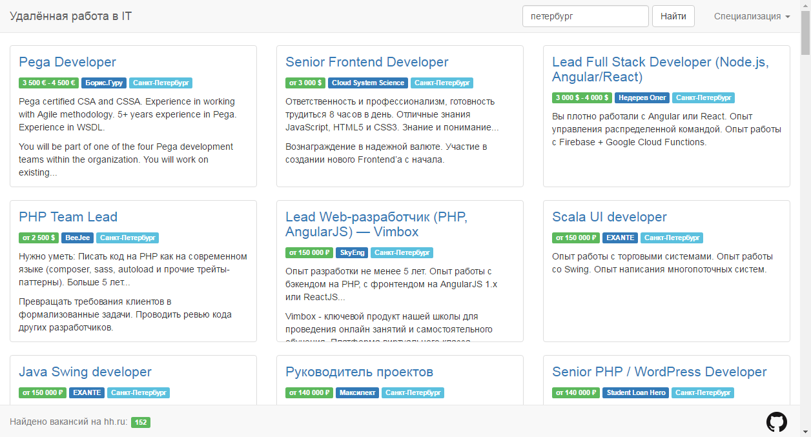

[](https://travis-ci.org/peshrus/hh-it-remote)
# hh-it-remote
The project fetches remote IT vacancies from hh.ru. It shows them on one page allowing to filter them by specialization and keywords. The page contains only specializations interesting for developers.



## Prerequisites
- Meteor 1.5 (https://www.meteor.com/)
- (**Optional**) Docker (https://www.docker.com/)

## Clone the Repo
```sh
git clone https://github.com/peshrus/hh-it-remote.git
cd hh-it-remote
```

## Test
```sh
meteor npm test
```

## Run
```sh
meteor run
```

Go to http://localhost:3000/

## Build a Docker Image

```sh
docker build \
  --build-arg INSTALL_MONGO=true \ 
  -t yourname/hh-it-remote .
```

## Run the Docker Image
```sh
docker run -d \
  -p 80:3000 \
  yourname/hh-it-remote
```
